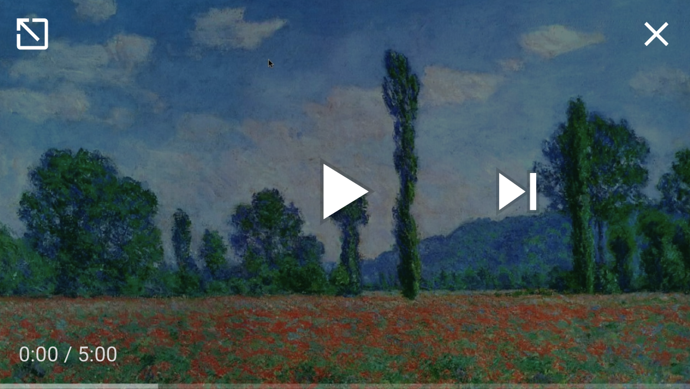

# SOVIA: Sonification of Visual Interactive Art - Monet

SOVIA is an interactive system that enhances Claude Monet’s art with a responsive auditory experiences.  Users can interact with the painting by moving their curser over the image, when the curser goes over an object detected by the computer vision it will play a sound mapped to that object. 

This project uses [Azure's Custom Vision](https://azure.microsoft.com/services/cognitive-services/custom-vision-service/) and [Pygame](https://www.pygame.org/). 

Source code is provided for referance but will not run on it's own because the config and resource files are not provided. 

## Video Demo

Video Demo features 7 different Monet paintings.

 
Select image above to video the demo on youtube.

## Downablable excludable 

Each time you run the file a random Monet landscape image will be select as well as different sounds for each object type. Computer Vision is then applied to the image to determine the objects presented. Slowly move your mouse across the image to find and hear sounds. 

An internet connection is required since this project uses a prediction model that is stored in Azure.

Select the right [zip file](https://github.com/lgayhardt/SOVIA/releases/tag/V1) for your computer system from releases to be able to run the SOVIA for yourself. 

### Windows 

Steps:
1. Download SOVIA_Monet_Windows.zip
2. Run excludable able file SOVIA_Monet.exe

### Mac OS 

Steps: 
1. Download SOVIA_Monet_MacOS.zip
2. To run excludable file  select run_SOVIA_Moent.commad or run the excluable file SOVIA_Monet in terminal

## Audio and Images Resources

 Sounds and music are from Zapsplat, Freesound, Mixkit, and Avosound. Monet paintings are from Wiki Art. 